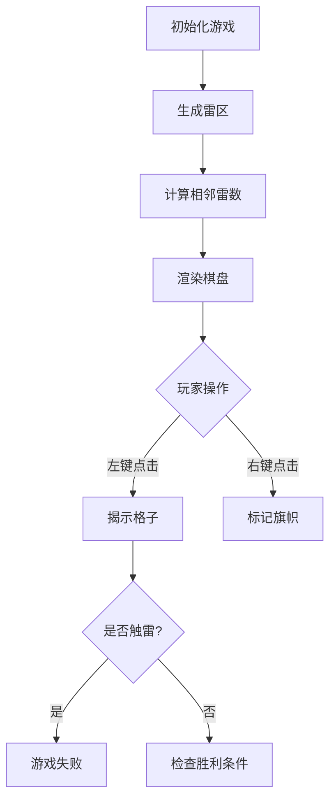

## 一、游戏概述
本教程将完整呈现如何用原生前端三剑客（HTML+CSS+JavaScript）实现经典扫雷游戏。该实现包含以下核心功能：

- **💥 智能雷区生成**：10x10格子随机分布10个地雷
- **🚩 标记功能**：右键标记可疑地雷位置
- **🔍 智能展开**：自动展开相邻安全区域
- **🎨 视觉反馈**：数字颜色区分/爆炸动画/胜利特效
- **📊 状态显示**：实时显示剩余雷数与游戏状态

## 二、代码结构解析

### 1. 界面布局（HTML）
```html
<div class="game-container">
    <div class="game-title">扫雷游戏</div>
    <div class="controls">
        <button class="new-game-btn" onclick="initGame()">新游戏</button>
        <div class="mines-counter">
            💣 剩余地雷: <span id="mines-count">10</span>
        </div>
    </div>
    <div id="board" class="board"></div>
    <div id="status" class="status"></div>
</div>
```

### 2. 视觉设计（CSS）
亮点特性：
```css
/* 现代渐变背景 */
background: linear-gradient(135deg, #f5f7fa 0%, #c3cfe2 100%);

/* 立体卡片效果 */
box-shadow: 0 10px 30px rgba(0, 0, 0, 0.1);

/* 数字颜色编码 */
.cell[data-number="1"] { color: #2196F3; }

/* 交互动画 */
transition: all 0.2s ease;
```

### 3. 游戏逻辑（JavaScript）
核心算法流程图：


## 三、功能亮点详解

### 1. 雷区生成算法
```javascript
// 随机放置地雷
let minesPlaced = 0;
while (minesPlaced < MINES_COUNT) {
    const x = Math.floor(Math.random() * BOARD_SIZE);
    const y = Math.floor(Math.random() * BOARD_SIZE);
    if (board[x][y] !== -1) {
        board[x][y] = -1;
        minesPlaced++;
    }
}

// 计算相邻雷数
function countAdjacentMines(x, y) {
    let count = 0;
    for (let i = -1; i <= 1; i++) {
        for (let j = -1; j <= 1; j++) {
            const newX = x + i;
            const newY = y + j;
            if (isValidPosition(newX, newY) && board[newX][newY] === -1) {
                count++;
            }
        }
    }
    return count;
}
```

### 2. 递归展开算法
```javascript
function reveal(x, y) {
    if (越界或已揭示) return;
    
    revealed[x][y] = true;
    remainingCells--;
    
    if (当前格子为空白) {
        // 递归展开相邻8个格子
        for (let i = -1; i <= 1; i++) {
            for (let j = -1; j <= 1; j++) {
                reveal(x + i, y + j);
            }
        }
    }
}
```

## 四、游戏操作指南

1. **左键点击**：揭示格子
2. **右键点击**：标记/取消标记地雷
3. **新游戏按钮**：重置游戏
4. **胜利条件**：正确标记所有地雷并揭示所有安全格子
5. **失败条件**：点击到地雷格子

## 五、扩展优化建议

1. **难度分级**：通过修改常量实现
   ```javascript
   // 初级
   const BOARD_SIZE = 10;
   const MINES_COUNT = 10;

   // 中级
   const BOARD_SIZE = 16;
   const MINES_COUNT = 40;

   // 高级
   const BOARD_SIZE = 24;
   const MINES_COUNT = 99;
   ```

2. **音效增强**：添加点击/爆炸/胜利音效
3. **排行榜系统**：记录最佳通关时间
4. **移动端适配**：添加触屏事件支持

## 六、完整源码

```html
<!DOCTYPE html>
<html>
<head>
    <meta charset="UTF-8">
    <title>扫雷游戏</title>
    <style>
        body {
            margin: 0;
            min-height: 100vh;
            display: flex;
            justify-content: center;
            align-items: center;
            background: linear-gradient(135deg, #f5f7fa 0%, #c3cfe2 100%);
            font-family: "Microsoft YaHei", sans-serif;
        }

        .game-container {
            background: white;
            padding: 2rem;
            border-radius: 15px;
            box-shadow: 0 10px 30px rgba(0, 0, 0, 0.1);
            display: flex;
            flex-direction: column;
            align-items: center;
        }

        .game-title {
            font-size: 2rem;
            color: #2c3e50;
            margin-bottom: 1rem;
            font-weight: bold;
        }

        .controls {
            background: #f8f9fa;
            padding: 1rem 2rem;
            border-radius: 10px;
            margin-bottom: 1.5rem;
            display: flex;
            gap: 2rem;
            align-items: center;
        }

        .new-game-btn {
            background: #4CAF50;
            color: white;
            border: none;
            padding: 0.8rem 1.5rem;
            border-radius: 8px;
            cursor: pointer;
            font-size: 1rem;
            transition: all 0.3s ease;
        }

        .new-game-btn:hover {
            background: #45a049;
            transform: translateY(-2px);
        }

        .mines-counter {
            background: #2c3e50;
            color: #fff;
            padding: 0.8rem 1.5rem;
            border-radius: 8px;
            font-size: 1rem;
            display: flex;
            align-items: center;
            gap: 0.5rem;
        }

        .mines-counter span {
            color: #ffd700;
            font-weight: bold;
        }

        .board {
            display: grid;
            grid-template-columns: repeat(10, 40px);
            grid-template-rows: repeat(10, 40px);
            gap: 2px;
            background-color: #34495e;
            padding: 3px;
            border-radius: 10px;
        }

        .cell {
            width: 40px;
            height: 40px;
            background: linear-gradient(145deg, #f0f0f0, #e6e6e6);
            border: none;
            border-radius: 6px;
            display: flex;
            align-items: center;
            justify-content: center;
            cursor: pointer;
            user-select: none;
            font-weight: bold;
            font-size: 1.2rem;
            transition: all 0.2s ease;
        }

        .cell:hover:not(.revealed) {
            background: linear-gradient(145deg, #e6e6e6, #f0f0f0);
            transform: scale(0.95);
        }

        .cell.revealed {
            background: #fff;
            box-shadow: inset 2px 2px 5px rgba(0,0,0,0.1);
        }

        .cell.flagged {
            background: linear-gradient(145deg, #ffd700, #ffc800);
        }

        .cell.mine {
            background: #ff5252 !important;
        }

        .status {
            margin-top: 1.5rem;
            padding: 1rem;
            border-radius: 8px;
            font-size: 1.2rem;
            font-weight: bold;
            text-align: center;
            min-height: 3rem;
            display: flex;
            align-items: center;
        }

        .game-over {
            color: #ff5252;
            animation: shake 0.5s ease-in-out;
        }

        .win {
            color: #4CAF50;
            animation: bounce 0.5s ease-in-out;
        }

        /* 数字颜色 */
        .cell[data-number="1"] { color: #2196F3; }
        .cell[data-number="2"] { color: #4CAF50; }
        .cell[data-number="3"] { color: #f44336; }
        .cell[data-number="4"] { color: #9C27B0; }
        .cell[data-number="5"] { color: #FF9800; }
        .cell[data-number="6"] { color: #009688; }
        .cell[data-number="7"] { color: #795548; }
        .cell[data-number="8"] { color: #607D8B; }

        @keyframes shake {
            0%, 100% { transform: translateX(0); }
            25% { transform: translateX(-5px); }
            75% { transform: translateX(5px); }
        }

        @keyframes bounce {
            0%, 100% { transform: translateY(0); }
            50% { transform: translateY(-10px); }
        }
    </style>
</head>
<body>
    <div class="game-container">
        <div class="game-title">扫雷游戏</div>
        <div class="controls">
            <button class="new-game-btn" onclick="initGame()">新游戏</button>
            <div class="mines-counter">
                💣 剩余地雷: <span id="mines-count">10</span>
            </div>
        </div>
        <div id="board" class="board"></div>
        <div id="status" class="status"></div>
    </div>

    <script>
        const BOARD_SIZE = 10;
        const MINES_COUNT = 10;
        let board = [];
        let revealed = [];
        let flagged = [];
        let gameOver = false;
        let remainingCells = BOARD_SIZE * BOARD_SIZE - MINES_COUNT;

        function initGame() {
            board = [];
            revealed = [];
            flagged = [];
            gameOver = false;
            remainingCells = BOARD_SIZE * BOARD_SIZE - MINES_COUNT;
            document.getElementById('mines-count').textContent = MINES_COUNT;
            document.getElementById('status').textContent = '';
            document.getElementById('status').className = 'status';

            // 初始化面板
            for (let i = 0; i < BOARD_SIZE; i++) {
                board[i] = new Array(BOARD_SIZE).fill(0);
                revealed[i] = new Array(BOARD_SIZE).fill(false);
                flagged[i] = new Array(BOARD_SIZE).fill(false);
            }

            // 随机放置地雷
            let minesPlaced = 0;
            while (minesPlaced < MINES_COUNT) {
                const x = Math.floor(Math.random() * BOARD_SIZE);
                const y = Math.floor(Math.random() * BOARD_SIZE);
                if (board[x][y] !== -1) {
                    board[x][y] = -1;
                    minesPlaced++;
                }
            }

            // 计算每个格子周围的地雷数
            for (let i = 0; i < BOARD_SIZE; i++) {
                for (let j = 0; j < BOARD_SIZE; j++) {
                    if (board[i][j] !== -1) {
                        board[i][j] = countAdjacentMines(i, j);
                    }
                }
            }

            renderBoard();
        }

        function countAdjacentMines(x, y) {
            let count = 0;
            for (let i = -1; i <= 1; i++) {
                for (let j = -1; j <= 1; j++) {
                    const newX = x + i;
                    const newY = y + j;
                    if (newX >= 0 && newX < BOARD_SIZE && newY >= 0 && newY < BOARD_SIZE) {
                        if (board[newX][newY] === -1) count++;
                    }
                }
            }
            return count;
        }

        function renderBoard() {
            const boardElement = document.getElementById('board');
            boardElement.innerHTML = '';

            for (let i = 0; i < BOARD_SIZE; i++) {
                for (let j = 0; j < BOARD_SIZE; j++) {
                    const cell = document.createElement('div');
                    cell.className = 'cell';
                    cell.dataset.x = i;
                    cell.dataset.y = j;
                    
                    if (revealed[i][j]) {
                        cell.classList.add('revealed');
                        if (board[i][j] === -1) {
                            cell.classList.add('mine');
                            cell.textContent = '💣';
                        } else if (board[i][j] > 0) {
                            cell.textContent = board[i][j];
                            cell.dataset.number = board[i][j];
                        }
                    } else if (flagged[i][j]) {
                        cell.classList.add('flagged');
                        cell.textContent = '🚩';
                    }

                    cell.addEventListener('click', handleClick);
                    cell.addEventListener('contextmenu', handleRightClick);
                    boardElement.appendChild(cell);
                }
            }
        }

        function handleClick(e) {
            if (gameOver) return;
            const x = parseInt(e.target.dataset.x);
            const y = parseInt(e.target.dataset.y);

            if (flagged[x][y]) return;

            if (board[x][y] === -1) {
                gameOver = true;
                revealAll();
                document.getElementById('status').textContent = '游戏结束!💥';
                document.getElementById('status').className = 'status game-over';
                return;
            }

            reveal(x, y);
            renderBoard();

            if (remainingCells === 0) {
                gameOver = true;
                document.getElementById('status').textContent = '恭喜你赢了!🎉';
                document.getElementById('status').className = 'status win';
            }
        }

        function handleRightClick(e) {
            e.preventDefault();
            if (gameOver) return;

            const x = parseInt(e.target.dataset.x);
            const y = parseInt(e.target.dataset.y);

            if (revealed[x][y]) return;

            flagged[x][y] = !flagged[x][y];
            let minesLeft = MINES_COUNT - countFlags();
            document.getElementById('mines-count').textContent = minesLeft;
            renderBoard();
        }

        function countFlags() {
            return flagged.reduce((count, row) => 
                count + row.reduce((sum, cell) => sum + (cell ? 1 : 0), 0), 0);
        }

        function reveal(x, y) {
            if (x < 0 || x >= BOARD_SIZE || y < 0 || y >= BOARD_SIZE || revealed[x][y] || flagged[x][y]) return;

            revealed[x][y] = true;
            remainingCells--;

            if (board[x][y] === 0) {
                for (let i = -1; i <= 1; i++) {
                    for (let j = -1; j <= 1; j++) {
                        reveal(x + i, y + j);
                    }
                }
            }
        }

        function revealAll() {
            for (let i = 0; i < BOARD_SIZE; i++) {
                for (let j = 0; j < BOARD_SIZE; j++) {
                    revealed[i][j] = true;
                }
            }
            renderBoard();
        }

        // 初始化游戏
        initGame();
    </script>
</body>
</html>
```
